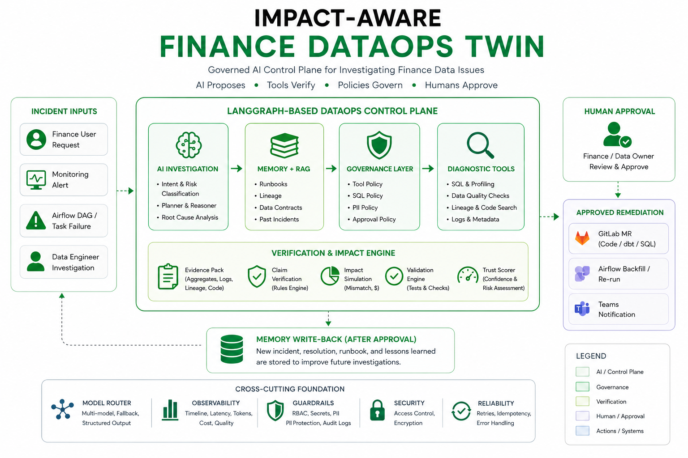

# Impact-Aware Finance DataOps Twin

Impact-Aware Finance DataOps Twin is a governed AI workflow for investigating
Finance data incidents. It combines LangGraph orchestration, model routing,
deterministic diagnostic tools, claim verification, validation, trust scoring,
and human approval into a controlled DataOps investigation loop.

The system is intentionally not a free-running autonomous agent. AI is used for
classification, planning suggestions, short narrative generation, review
comments, and candidate issue proposals. Evidence, policy, validation, and
approval remain the source of truth.

## Why This Exists

Finance data incidents are high-risk: a small transformation bug can affect
reported revenue, cash flow, spend, or receivables. A data engineer usually has
to trace metric definitions, inspect pipeline lineage, profile source data,
read transformation code, quantify impact, propose a fix, validate the result,
write an RCA, and wait for business approval.

This project turns that workflow into an auditable control plane:

```text
State -> Model -> Tools -> Routing -> Verification -> Validation -> Human Approval
```

## Architecture Overview




## Core Principles

- Tool evidence beats LLM narrative.
- Raw transaction rows are not sent to the LLM.
- LLM calls are routed through structured-output interfaces and schema checks.
- SQL profiling, validation, claim status, trust scoring, and approval decisions
  are deterministic.
- Low-confidence cases escalate instead of fabricating a root cause.
- Candidate issue types can be proposed, but they are not promoted into
  detectors or runbooks without human review.
- Finance-impacting changes require approval before remediation is applied.

## What It Can Do

- Investigate metric mismatches such as revenue reconciliation drift.
- Detect enum drift, missing partitions, null spikes, duplicate records,
  distribution drift, and volume drops.
- Build bounded diagnostic plans from a governed tool registry.
- Retrieve metric definitions, runbooks, prior incidents, and pipeline context.
- Produce evidence-backed root-cause hypotheses.
- Verify claims against collected evidence.
- Simulate impact before and after a proposed fix.
- Generate safe patch proposals and dbt-style regression tests.
- Produce RCA reports and trust matrices.
- Route high-risk actions through human approval.
- Triage job failures from logs and propose safe remediation actions.
- Propose candidate definitions for new issue patterns in Unknown Issue Mode.

## Example Investigation

Input:

```text
Revenue report 2026-06-07 is off by 2.1% versus the payment dashboard.
```

Typical output:

- intent: `investigate_revenue_mismatch`
- metric: `net_revenue`
- risk: `high`
- anomaly: `enum_drift`
- evidence: source data contains `PARTIAL_REFUND`
- code finding: transformation handles `REFUNDED` but not `PARTIAL_REFUND`
- impact: before/after reconciliation and affected amount
- patch proposal: expand the refund status mapping
- validation: fail-before / pass-after checks
- final state: ready for Finance/Data Owner approval

## Unknown Issue Mode

When no known detector matches, the system does not force the case into an
existing taxonomy. If the request clearly signals a new pattern, it may produce
a candidate issue definition:

```json
{
  "candidate_issue_type": "dimension_allocation_drift",
  "description": "Metric total may reconcile, but allocation by a reporting dimension appears inconsistent.",
  "suggested_tools": ["dimension_reconciliation", "lineage_lookup", "code_search"],
  "requires_human_review": true
}
```

This is a proposal only. Promotion into a real detector, runbook, or memory
entry requires review and approval.

## Repository Layout

```text
agents/          Governed reasoning components: classifier, planner, RCA, review, issue proposal
api/             FastAPI boundary used by the React/Next console
app/             Streamlit demo UI and visual components
data/            Seed data and mock logs
database/        SQLite connection, schema, and demo database assets
domain/          Metric contracts and scope resolution
evals/           Golden-set and grounding evaluators
governance/      Approval, action, claim, PII, SQL, and tool policies
graph/           LangGraph state, nodes, edges, and routing conditions
memory/          JSON memory for users, metrics, pipelines, policies, and incidents
model_router/    Task-aware model routing and provider adapters
monitoring/      Proactive sweep, scheduler, alert, and trigger logic
orchestration/   Tool registry, planner/executor models, MCP gateway/transport
pipelines/       Example dbt-style SQL models with seeded finance bugs
rag_docs/        Runbooks, data contracts, metric dictionary, and prior incidents
remediation/     Strategy registry for code and operational remediation
reports/         Trace output
tests/           Unit, integration, workflow, governance, and eval tests
tools/           Deterministic diagnostic, validation, evidence, and reporting tools
web/             Next.js operational console
```

## Quickstart

Create a Python environment and install dependencies:

```powershell
python -m venv .venv
.\.venv\Scripts\Activate.ps1
pip install -r requirements.txt
```

Seed demo data:

```powershell
python -m data.seed_data.seed
```

Run the CLI demo:

```powershell
python demo.py
```

Run the Streamlit control-plane UI:

```powershell
streamlit run app/main.py
```

Run tests:

```powershell
pytest -q
```

## Next.js Console

The `web/` directory contains a React/Next operational console that talks to the
FastAPI server.

Install optional API dependencies if they are not already available:

```powershell
pip install fastapi uvicorn
```

Start the API:

```powershell
python -m uvicorn api.server:app --reload --port 8000
```

Start the web console:

```powershell
cd web
npm install
npm run dev
```

Open:

```text
http://localhost:3000
```

The web client uses `NEXT_PUBLIC_API_BASE` and defaults to
`http://127.0.0.1:8000`.

## Model Routing

Routes are configured in `model_router/models.yaml`.

The router supports:

- Anthropic-style providers for reasoning-heavy routes
- OpenAI-compatible providers for local or hosted MaaS models
- route-level fallbacks
- structured JSON output validation
- retry on schema mismatch
- observability hooks for token and model usage

The current codebase is designed to keep model usage optional for local demos:
if a provider is unavailable, many nodes fall back to deterministic behavior so
the workflow remains testable offline.

## Governance and Safety

The governance layer is deliberately separate from prompts and model output.

Key controls include:

- SQL policy checks and partition enforcement
- tool allow/block decisions by risk tier
- PII and raw-row safeguards
- claim-level evidence requirements
- confidence gates
- validation before report finalization
- human approval before finance-impacting remediation
- memory write-back only after approved or corrected outcomes

## Evaluation

The test suite covers deterministic tools, graph routing, governance, trust
scoring, patch generation, monitoring, incident triage, MCP transport stubs,
unknown issue behavior, and golden-set evaluation.

Useful commands:

```powershell
pytest tests/test_unknown_issue_mode.py tests/test_root_cause.py
pytest tests/test_golden_set.py
python -m evals.evaluate_all
```

## Deployment Notes

The Dockerfile packages the Streamlit UI behind nginx for environments that
expect a single HTTP port:

- public port: `8080`
- Streamlit internal port: `8501`
- health endpoint: `/health`

See `DEPLOY.md` for the AgentBase-oriented deployment notes.

## Documentation

- `PROJECT_DOC_v4.md`: full product and architecture design document
- `ARCHITECTURE_AGENTIC.md`: planner/executor migration notes
- `agents/README.md`: explains why `agents/` contains governed reasoning
  components rather than free-form personas
- `docs/INTEGRATION_MCP.md`: MCP integration boundary notes

## Project Status

Implemented capabilities include:

- LangGraph investigation workflow
- planner-driven diagnostic execution
- deterministic SQL profiling and validation
- memory and RAG context retrieval
- tool governance and approval policies
- claim verification and trust scoring
- safe patch proposal and RCA generation
- proactive monitoring sweep
- incident log triage
- lineage and impact Q&A
- golden-set evaluation
- Unknown Issue Mode with candidate issue proposals
- Streamlit demo UI and Next.js console

## Positioning

This is not a chatbot for querying Finance data. It is a controlled DataOps
workflow for protecting trust in Finance metrics:

```text
AI proposes and explains.
Tools measure and verify.
Policies decide what is allowed.
Humans approve business-impacting change.
```
